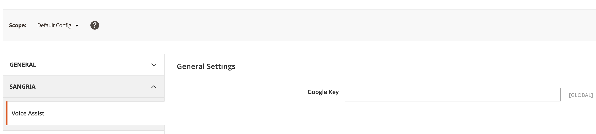
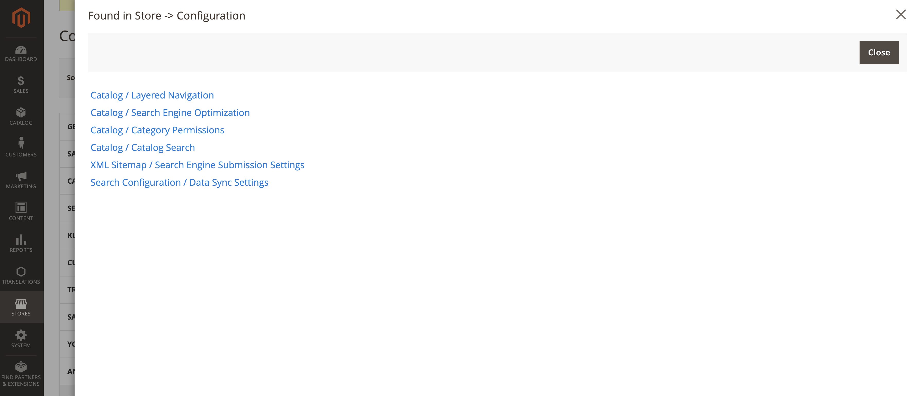

# User Guide

## Installation

### Installation via Composer

1. Navigate to your [Magento root directory](https://devdocs.magento.com/guides/v2.4/extension-dev-guide/build/module-file-structure.html).
1. Enter command: `composer require sangria/module-backend-voice`
1. Enter command: `php bin/magento setup:upgrade`
1. Enter command: `php bin/magento setup:static-content:deploy`
1. Put your Magento in production mode if it’s required.

## Configuration

Module configuration settings located in Store -> Configuration -> Sangria -> Backend Voice section.

Module uses Google Speech-To-Text service for voice recognition. To setup it corBackendVoice/Model/Parser/ConfigParser.phprectly you have to register at google cloud and generate API key. 
Please, refer to https://cloud.google.com/speech-to-text to obtain a google key.
Specify google api key and save configuration.

## Usage

Since the module installed and configured, you will see a mic icon close to a search icone in admin panel.

Now you have to be able to use Magento backend voice assistant. Click the mic icon and name any menu items to find it.

Examples of voice commands:
 - "product list"
 - "catalog categories"
 - "sales orders"
 - "sales invoice"
 - "tax rules"
 - "tax zones and rates"

Saying "sales orders" you will see a recognition process...

...and, as a result, you will see founded menu item as a link like shown below

To find any Store Configuration settings say: "find settings ****", for example:
 - "find settings payment methods"
 - "find settings ttl"
 - "find settings catalog search"
 - etc...

As a result you will see all found items in a popup window like this

